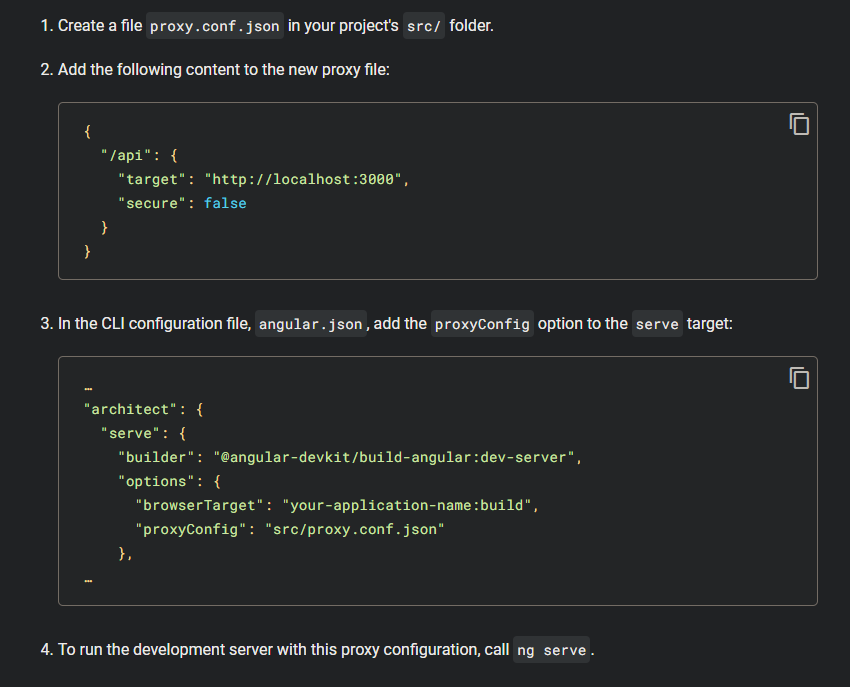
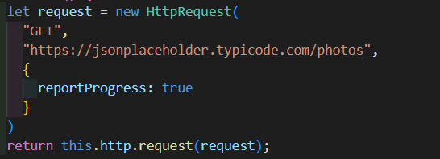
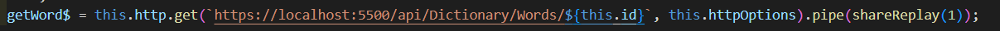
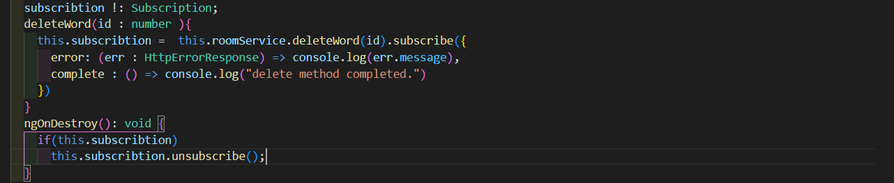
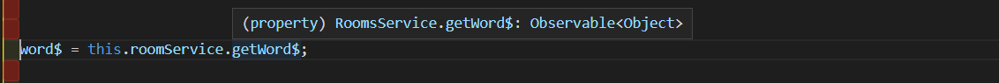
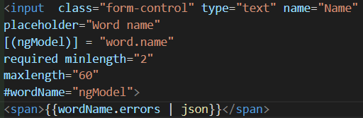
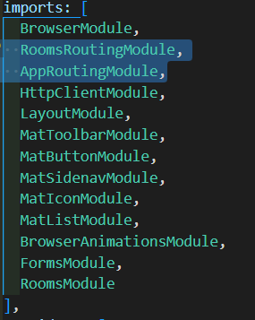

- [Angular Notes](#angular-notes)
    - [CLI Commands](#cli-commands)
    - [Modules](#modules)
      - [Route Module](#route-module)
      - [Ng Module](#ngmodule)
    - [Component](#components)
      - [Variables in @Component](#variables-in-component)
        - [selector](#selector)
        - [template / templateUrl](#template-templateurl)
        - [styles / styleUrls](#styles-styleurls)
      - [Note: prefix](#note-prefix)
    - [Directives](#directives)
      - [Structural Directives](#structural-directives)
      - [Attribute Directives](#attribute-directives)
      - [Built-in Directives](#built-in-directives)
        - [Directive 1- ngIf](#directive-1-ngif-expression-that-can-be-converted-to-boolean)
          - [Optional chaning](#optional-chaining)
        - [Directive 2- ngFor](#directive-2-ngfor)
        - [Directive 3- ngSwitchCase](#directive-3-ngswitch)
        - [Directive 4- ngClass](#directive-4-ngclass)
        - [Directive 5- ngStyle](#directive-5-ngstyle)
    - [Pipes](#pipes)
      - [Built-in Pipes](#built-in-pipes)
        - [date](#date)
        - [lowercase](#lowercase)
        - [title](#titlecase)
        - [percent](#percent)
        - [json](#json)
        - [slice](#slice)
        - [number](#number-for-decimals)
    - [Adding Bootstrap](#adding-bootstrap)
    - [Lifecycle Hooks](#lifecycle-hooks)
      - [ngOnInıt](#ngoninit)
    - [Component Communication](#component-communication)
      - [Input](#input)
      - [Output](#output)
    - [Change Detection](#change-detection)
    - [ngOnChanges](#ngonchanges)
    - [DoCheck](#docheck)
    - [Using Other Component's member without @Input or @Output](#using-other-components-member-without-input-or-output)
    - [ng-templates](#ng-templates)
    - [Template Reference](#template-reference)
  - [Content Projection](#content-projection)
    - [ngContentInit](#ngcontentinit)
    - [ngOnDestroy](#ngonchanges)
  - [Dependency Injection](#dependency-injection)
    - [Services](#services)
    - [Dependency Resolution Steps](#dependency-resolution-steps)
    - [Resolution Modifiers](#resolution-modifiers)
      - [Self](#self)
      - [SkipSelf](#skipself)
      - [Optional](#optional)
      - [Host](#host)
    - [Dependency Injection Providers](#dependency-injection-providers)
      - [Class Based Providers](#class-based-providers)
      - [Value Providers](#value-providers)
  - [HTTP and Observables](#http-and-observables)
    - [Setting HTTP Client](#setting-http-client)
    - [Using HttpClient in services](#using-httpclient-in-services)
    - [Observable](#observable)
    - [HTTP Requests](#http-requests)
      - [HttpEventTypes](#httpeventtypes)
      - [RxJs Operators](#rxjs-operators)
        - [shareReplay](#sharereplay)
          - [unsubscribtion using async pipe](#unsubscribtion-using-async-pipe)
        - [CatchError](#catcherror)
        - [Map Operators](#map-operators)
  - [Http Interceptors and APP_INITIALIZER](#http-interceptors-and-app_initializer)
    - [Http Interceptors](#http-interceptors)
    - [App_Initializer](#app_initializer)
  - [Angular Router](#angular-router)
    - [Setup Router](#setup-router)
      - [Using Anchors](#using-anchors)
      - [Router Outlet](#router-outlet)
      - [Angular Material](#angular-material)
    - [Wild Card Routes](#wild-card-routes)
    - [Dynamin Routes](#dynamic-routes)
    - [ActivatedRoute Service](#activatedroute-service)
  - [Forms](#forms)
    - [Template Driven Forms](#template-driven-forms)
      - [Setting Up Forms](#setting-up-forms)
      - [Binding](#binding)
      - [Submitting](#submitting)
    - [Validations](#validations)
      - [Error Messages](#error-messages)
    - [Resetting Forms](#resetting-forms)


# Angular Notes
------------------
$~~~~~~$
## CLI Commands


- ``ng new projectName`` => creates an angular project with default application

- ``ng new projectName`` --createApplication=false => creates an angular empty angular project
    - ``ng g app`` also do the same thing.

## Template Syntax


### Modules

#### Route Module
- We need at least 1 module to bootstrap our app, and it's called as Route Module.
    - Anguler adds route module as default whose name is AppModule in app.module.ts file.

- Route Module contains information about which angular components, directives, pipes, 3tr party libs, spesific angular libs and Modules are being used so that in main.ts file, application starts with the information in Route Module.
    - ````js
        //main.ts
          platformBrowserDynamic().bootstrapModule(AppModule)
      .catch(err => console.error(err));
      ````

#### NgModule

- NgModule is a decorater that contains all metadata information about Module's component, libs, directives.

````js
@NgModule({
  declarations: [
    AppComponent
  ],
  imports: [
    BrowserModule,
    AppRoutingModule
  ],
  providers: [],
  bootstrap: [AppComponent] //this is the component will be loaded first.
})
export class AppModule { }
````


### Components

- Once we created a component, we get 4 files
    - app.component.ts
    - name.component.html
    - name.component.scss
    - name.component.spec.ts 
- We need one root component as we need one root module.
- Components can be called views.

#### Variables in @Component

##### selector

- It selects the element where we wanna render our component(view).

##### template / templateUrl

- template is used to use inline html
- templateUrl is used to use hmtl file.
    - It gets relative path like ./fileName.html


##### styles / styleUrls

- styles prop gets string arrays to style the html.
- styleUrls prop also gets string array to locate the css/scss files to style the html.


-----------------------------


### Note: prefix

- Prefix is used as prefix when we create new components and angular suggests that we should use prefixes to avoid confliction with another elements which my exist.

- It is assigned in angular.json

- People changed the app prefix to what they want or what their company/project name is.

- now, when we create new components, their selector is set to ``prefix-componentName``


### Binding Syntax


- Angular has 3 binding sytax
  - Interpolation
  - Property Syntax
  - Event Binding

#### Binding Syntax

- html files can use variables from component class using double curly brackets

````js
<h2>Welcome to {{hotelName}}</h2>
//hotelName comes from rooms component class
````


#### Property Syntax

- Angular adds some properties and one of them is to bind our variables to elements.
- we can use ``[innerText]`` property in elements which actually means ``document.getElementById('elementWeAreOn').innerText`` to bind variable
$
````js
<div [innerText] = 'hotelName'></div>
````
- the properties defined built-in are solely usable in property syntax
(box syntax is being used)

#### Event Binding

- To bind events in Angular, banana syntax is used.

````js
//In JavaScript
<button onClick = "function()"></button>
````

````js
<button (click) = "toggle()">Toggle</button>
````

## Directives

- Directives are use to change the behaviour or apperance of DOM elements

- They can implement all lifecylce hooks

- They dont have any templates, just have the logic.

- There are 2 types of Directives

### Structural Directives

- They are the directives that changes the DOM layout by adding and removing DOM elements.

- they may cause performanse issue that means they are costlier than Attribute Directives.


### Attribute Directives

- It changes the apperance of DOM.


### Built-in Directives

#### Directive 1: *ngIf = "expression that can be converted to boolean"
- ngIf is used to remove or add html elements to DOM based on a if statement we set.

- By the way, hidden property doesn't remove the element that it's implemented, it'll still appear in 'Inspect the source'.


--------------------------------------
__A small feature of TS__
###### Optional Chaining

* ?. is used to stop running when encounter to null or unefined values.

````js

// in angular, we can use them with ngIf

<p *ngIf = "rooms?.availableRooms && rooms.availableRooms > 0"></p>

````

-------------------------------------------


#### Directive 2: *ngFor

* It allows us to use for each statement in elements.
````js
<tr *ngFor="let room of roomList">

</tr>
````

* ngFor also allows us to get if the for each loop count even or odd.

````js
<tr *ngFor = " ...; ...; ...; let e = even; let o = odd">
<td>{{e ? "Even" : "Odd" }}</td>
</tr>
````

- Whatsmore, it allows us to get index of the collection being used.

````js
<tr *ngFor = " ...; ...; ...; let i = index">
  <td>{{i}}</td>
</tr>
````


#### Directive 3: ngSwitch

- It allows to add switch-case statements, it kind of differs from other structural directives.

````js
<div [ngSwitch]="role"> // It takes a variable to check its value
    <div *ngSwitchCase="'Admin'"> // case controlled, remember to use '' if value is string
        <hinv-rooms></hinv-rooms>
    </div>
    <div *ngSwitchCase="'User'">
        <div>
            Welcome to the page, User!
        </div>
    </div>
    <div *ngSwitchDefault> // this is default case
        <div>
            You are not allowed to view this page!
        </div>
    </div>
</div>
````


#### Directive 4: ngClass

- It allows us to change elements' class.
````js
<div [ngClass]="e ? 'even': 'odd' " // we determine class if it is even or odd
     [ngSwitch]="role"> // It takes a variable to check its value
    <div *ngSwitchCase="'Admin'"> // case controlled, remember to use '' if value is string
        <hinv-rooms></hinv-rooms>
    </div>
    <div *ngSwitchCase="'User'">
        <div>
            Welcome to the page, User!
        </div>
    </div>
    <div *ngSwitchDefault> // this is default case
        <div>
            You are not allowed to view this page!
        </div>
    </div>
</div>
````


#### Directive 5: ngStyle

- It allows us to change style of the elements

````js
<div [ngStle]="{color: rooms.availableRooms ? 'green' : 'red'}">
````


## Pipes

- Pipes are used to tranform our data.

- They keep the data as it is but format it.

- usage is simple, just add | symbol by the variable and use pipe name.

### Built-in Pipes

#### date

- transform data typed variables to date as will.

- there are some pre-defined options
  - ... | date : 'short' or 'long' or 'shortDate'
    - also it can be specified like 'dd/MMM/yyyy'
  - Here is the list of pre defined options


#### lowercase

- everything will be displayed as lowercase

#### titleCase

- each word's first letter will be capitilized.


#### percent

- makes numbers percentaged


#### json

- it is used to convert objects to json format in development stage

#### slice

- it slices arrays and gets 2 parameter
  - ``slice : firstIndex : lastIndex``
    - first index is included but lastIndex not.
- suggestion : don't use slice for pagination, do it in server side.


#### number (for decimals)

- It allows us to configure decimal values' display.
  - number : 'before.min-max'
    - before => default 0 - it puts zeros before the value.
    - min => default 0 - it determines min fractions (if doesn't exist, it adds zero to complete min value we pass)
    - max => default 3 - it determines max fractions (if doesn't exist as much as the amounth we pass, just skips)


## Adding Bootstrap
- in app.component.css - sass - scss file, add the import statement below.
``@import '~bootstrap/dist/css/bootstrap.min.css';``

- or in angular.json file, add the path like above to this part 
````js
"styles": [
  "src/styles.scss",
  "bootstrap/dist/css/bootstrap.min.css"
]
````
--------------------------------------

## Lifecycle Hooks

- lifecycle starts when angular instantiates component and its child view and it ends when Angular destroys the component instance and removes its rendered template from the DOM.


### ngOnInit

- we should use constructor to be able to instantiate our component class but we shouldn't use constructor to set data. constructor should be used to inject services.

- ngOnInit is used to instantiate lifecycle and gets data to set our props.

- ngInıt must be implemented to related component class


### Component Communication


- as the app grows, components will need to communicate with each other and we also make them communicate with each other creating reusable html tags by passing data to them.

- There are 3 ways for component communication


#### Input 

- Input is a decorator that makes the components selector element be able to get data from property.

- ``@Input() rooms : IRoomList[] = [];``

- then we pass the data required like this:
  - ``<hinv-rooms-list [rooms]="roomList"></hinv-rooms-list>``


- What we can infere is we created a new component just renders the the list of rooms by getting data using _@Input_. All It knows is just render the data. The component that contains this component is passes data to the room-list component.

- This relationship can be called parent-child or smart-dumb. 
  - parent/smart is room-component (that passes data) and child/dumb is room-list component (that gets data to render sth)

- For sake of single responsibility principle, split the components down as their purpose.


#### Output

- Input is used to get data from other components. So output is used to give data to other components. Since we called the data receiver component as "dumb or child", we don't wanna let him to handle operations. We create EventEmitters to make it emit event we actually defined events in parent components. this is the way we can give data to parent components from child components.

- First off, we use @Output and create Event emitter:
  - ``@Output() selectedRoom = new EventEmitter<IRoomList>()``
- Then we add a method that gets a IRoomList item as a parameter and use it for event emitting.
  - ``SelectRoom(room:IRoomList){ this.selectedRoom.emit(room); }``
- Add this method to a element's event like button click.
  - ``<td><button class="btn btn-primary" (click)="SelectRoom(room)">Select</button></td>``
- So far, it doesn't know what to do with this room object, it is just an event emitter.
  - ``<hinv-rooms-list [rooms]="roomList" (selectedRoom)="selectRoom($event)"></hinv-rooms-list>``
    - (selectedRoom) => event call
    - "selectRoom($event)" event given by the parent component
  - Time to a method to pass for that event.
    - ``selectRoom(room:IRoomList){ console.log(room) }`` => It is the operation will be handled for selectedRoom event.

### Change Detection

- Angular has a feature to keep tracking of changes in all views named Change Detection.

- Change Detection is configured in Component Decorator. 

  - changeDetection: ChangeDetectionStrategy.OnPush or default.
  - OnPush deactivates the auto detection.
  - To be able to change it to OnPush, you must not change data in the component. So, if the data come from outside, you can use OnPush.
    - Also, if the variables used in the component change, immutable variables must be passed to be able to get updated data.
      - to make it immutable, you must pass new instance of the object. mutable means that changing so as we pass new instance of an object we passed a immutable object.
      - for instance, instead of rooms.push(room), use rooms = [...roomList, room].


### ngOnChanges

- To use ngOnChanges, @Input need to be used to keep track of sth.

- onChange interface is implemented to use ngOnChanges

- Here is the method :
````js
ngOnChanges(changes: SimpleChanges): void {

}
````

- Changes can be monitored using changes object like this

````js
changes['propName'] => it returns true or false 

````

### DoCheck

- It is hardly used but it allows us to track of event around of all application. This makes it so costly, avoid using it!


### Using Other Component's member without @Input or @Output

- When we don't have access to another component with inputs and outputs but we wanna fetch their member, ViewChild Decorator can be used.

- How it is used :

````js
@ViewChild(HeaderComponent) headerComponent! : HeaderComponent;
````

- But there are some point we need to be careful:

  - headerComponent can't be initialized during or before ngOnInıt. It is because headerComponent can have delay and cause problems. so, to be able to get the component as ready to use, AfterViewInit is used. (also child component's tag must be used in component html)
  - Though, there is a way to override this and fetch the component in ngOnInıt.
    - If the component doesn't have any delay, add a new object has static member and set it true. Its default value is false not to cause any exception due to delay. If the child component is a async component, set it to false.
    - ``@ViewChild(HeaderComponent, {static:true}) headerComponent! : HeaderComponent;``

- ViewChildren can be used for multiple childs

### ng-templates

* templates never render anything but help to render other templates or __components__

- templates can be used with ViewChild to render Component.

````js
export class AppComponent implements AfterViewInit {
  
  @ViewChild('user', {read : ViewContainerRef}) vcr! : ViewContainerRef;
  
  ngAfterViewInit(): void {
    const componentRef = this.vcr.createComponent(RoomsComponent);
  }
  // componentRef can be used to get the props using componentRef.instance.Props
}
````

### Template Reference

- It is similar to ng-templates
````js
    @ViewChild('name', {static: true}) nameEl! : ElementRef;

    ngOnInit() {
      this.nameEl.nativeElement.innerText = 31;
    }
````

## Content Projection

- We use ng-content to project the content passed into its selector.

````js
//  if we pass content without using ng-content like this 
<hinv-container>
    <h1>Hello from ng-content</h1>
</hinv-container>
// h1 element won't be displayed
````

````js
// but if we use ng-content in container's html file, it will be displayed
<ng-content></ng-content>
````

- Also we can decide the order of process of loading contents
````js
// The order we decide using in container.component.html
<ng-content select="hinv-employee"></ng-content>
<ng-content></ng-content>
<ng-content select="hinv-rooms"></ng-content>

//app.component.html

<hinv-container>
    <hinv-rooms></hinv-rooms>
    <h1>Hello from ng-content</h1>
    <hinv-employee></hinv-employee>
</hinv-container>
// even if we put these content the order of hinv-room - ngcontent - hinv-employee, order is overridden by the order we have decided in container.component.html
````
### ngContentInit

- now it is abvious that we can access the components passed into ng-content element using ngContentInit.

- The way we do it is that using ngAfterContentInit from afterContentInit interface.

- there is no static option.


### ngOnDestroy

- ngOnDestroy is called when a component got destroyed. This is the last lifecycle hook.

- ngOnDestroy is used to unsubscribe the data subscriptions so that the consuption can be reduced.


## Dependency Injection


### Services 

- Business needed in components will be written in services and we should have multiple services to be able to make them reusable. All those services will be used by injecting with DI provided by Angular 

- Besides, services are responsible of sharing data between components and app.

- Services injected in constructor should be defined as _private_. It is because that we should not access it from the templates.


- The resolution of the servises are used to be done adding services to Providers bundle in appModule.

- Now, Angular came with an approach that adds services by itself if the provideIn set to root.

````js
@Injectable({
  providedIn: 'root'
})
````
- In case the server gets never used, it will be removed from the sevices.
- This approach gives a single instance of the service, which is also called Singleton Design Pattern.

- If seperate service instances is desired, add the following to the @Component in the component in need of seperate instance of the service.

``providers : [RoomsService]``


- You should carefully decide whether you need single instance or not.


### Dependency Resolution Steps

- First off, component which the service injected in will be search the service.

- Then parent module will be asked if it has the service or not. If it doesn't, app module will be asked.

- platformBrowserDynamic will be asked if it has it lastly.

- If there is no service provider, NullInjectorError will be thrown.


### Resolution Modifiers

#### Self

- It forces to DI to get the service from its local injector (in @Component decorator's providers bundle.), if the local injector doesn't exist, throws nullinjector error.

#### SkipSelf

- It tells DI to skip cheking local injector. Even if service provider locally defined in @Component, it skips that.


#### Optional

- It tells DI not to throw error if the service provider not found. 

- Optional modifier can be beneficial in case you wanna use some services just in development environment, and then remove the service providers.

- OFC, you must add ? to variables which comes from optionally injected services bc they can be null so that we can skip the variable.


#### Host

- It hosts the service to the childen components(may come from ng-content)

- The component @Host is used must have locally provider to the service.

### Dependency Injection Providers


#### Class Based Providers

- ng g s name provides class based provider, so we have used them until now.


#### Value Providers

- Using object as a service

- value providers can be useful when we get values like api endpoints from config files. Instead of injecting config classes, we can make them a service.

The way proving values as a service - case 1 providing endpoint url:

- in a ts file for service, use InjectionToken that takes an interface as a generic.
``export const APP_SERVICE_CONFIG = new InjectionToken<IAppconfig>('app.config');``
- the interface contains what you need as a value, it can be url string for an endpoint.
``export interface IAppconfig{apiEndpoint : string;}``

- then provide values in the ts file below Injection:

````js
export const APP_CONFIG : IAppconfig = {
    apiEndpoint: environment.apiEndpoint
};
````

- Then add the created service to providers in the app.module.

````js
.
.
.
  providers: [
    {
      provide : APP_SERVICE_CONFIG,
      useValue: APP_CONFIG
    }
  ],

````

- To consume the service, we need to use Inject decorator by passing the token we've defined to use.
``constructor(@Inject(APP_SERVICE_CONFIG) private config : IAppconfig )``

case 2 - using APIs like localstorage, sessionStorage or window as an value provider


- We used InjectionToken again but didn't give any interface. We added a object that contains provideIn for DI and factory to return APIs
````js
export const localstorage = new InjectionToken<any>('localstorage', {
    providedIn:'root',
    factory() {
        return localStorage;
    },
});
````
- Then injected in constructor

``@Inject(localstorage) localStorage : Storage``

- Reject using APIs directly and this way allows you to get the required services.


## HTTP and Observables


### Setting HTTP Client

- İmport HttpClientModule
  - things ending with 'Module' might be set up in module level. 
````js
...
  imports: [
    BrowserModule,
    AppRoutingModule,
    HttpClientModule //which comes from @angular/common/http
  ],
...
````

- to proxy a localhost server, see this https://angular.io/guide/build#proxying-to-a-backend-server



### Using HttpClient in services

- OFC, it needed to be injected.

- pass this to the constructor => ``private htpp : HttpClient``

- then to make a get request,

````js
this.http.get("/api/dictionary/words"); // proxy will divert us to the localhost we set.
````

- the request will return an ``observable<type>``


### Observable 

- we use rxJs library and it uses the push arch. instead of pull.
  - in push arch, a stream gets and push the data to us and we must subscribe to the stream to get the data.
- Once we subscribe, we can access it as object by default. It can be changed though.
  - by using generics, data can be taken desired type. => ``...get<Word>``

- a new Observable can be created using new Observable()
  - It gets observer as a paramater, using arrow functions.
  - observer.next() this means that you emit a new data that the subscriber will get.
  - observer.complete() finishes the stream.
  - observer.error is used to handle errors.
  - field that the created observable is set to can be subscribed and give data that we pass using observer.next().


````js
// data can be received like that
this.stream.subscribe(data => {
      console.log(data);
    });

   this.stream.subscribe({
    next : (value) => //value can be used here,
    complete : () => // do sth when it is completed,
    error : (err) => // take an action when get error using err.
   })
````


### HTTP Requests


- We can reach the request status using HttpRequst class so that we can take actions depend on the status.
  - just remember to use ``{reportProgress = true}`` while creating new Request and pass it to show some progress of the request.
  - 


#### HttpEventTypes

- As I mentioned, the request status can be watched and used and this is the class we need to consume its status.

- There how it is used:


- As seen, data variable's type is HttpEvent


### RxJs Operators

- as we cannot modify stream without getting inside of it, the operators are used to modify stream's data. 

- pipe is used to call RxJs Operators
#### shareReplay

- It helps us to cache the data.
- If the component uses the same instance of the service, it caches the request responses and avoid multiple requests.
- Here it is how its done:


- $ sign is a convention to show the variable is stream.
----------------
- back to the pipes
##### unsubscribtion using async pipe

- subscribtion is a continuous relation which can burden on us if we don't unsub what we subbed to before.

- we can unsub subscribtions in ngOnDestroy using Subscription class.

- here it is:




- Here async pipe comes in the ring!

- set to the observable which can be subscribable to a property and use it as template syntax

- async pipe takes the subscribtion in template like this ``{{wordList$ || async ||json }}``

- it unwrap the data come from this sub and once the component destroyed, it takes care of the unsubscribtion process.

  - step 1

  

  - step 2 is ``{{wordList$ || async ||json }}`` this

- attention! since async pipe can return null, you may need to change the data type to nullable.


#### CatchError

- CatchError is used to catch errors of streams.

- The errors caught by CatchError are also assignable to Subject typed object which is a special Observable that can be both observable and observer. It means that you can pass error to it and also u can access the errors that is being passed to it.

````js
// this code should be written in service, do not write code like this in component class!!!!
error$ = new Subject();
  word$ = this.roomService.getWord$.pipe(
    catchError((err) => {
      this.error$.next(err.message); // error message is being passed to error$ which is a Subject object. It can be used with async pipe in template syntax to show the error.
      return of(); // Dunno what it is
    })
  );

````


#### Map Operators

- Map operators are used to change the data come from a stream and without subscribing it. It'll still return a stream bc we modiy it using rxJs operators.

- Here is an example:


- As seen, it returns ``Observable<number>`` it's bc we are getting the length.

## Http Interceptors and APP_INITIALIZER

- Before goint into interceptors, we can modify request header using HttpHeader class and pass it to the second parameter of the request as request's options.


### Http Interceptors

- It's a function that intercepts and modifies HTTP requests before they are handled by the app.

- you can generate new Intercepter using ng cli
  - ``ng g interceptor <name>``

````js
@Injectable()
export class RequestInterceptorInterceptor implements HttpInterceptor {

  constructor() {}

  intercept(request: HttpRequest<unknown>, next: HttpHandler): Observable<HttpEvent<unknown>> {
    console.log(`Request in Interceptor ${request}`); 
    return next.handle(request); // interceptor is a function that returns the intercepted request. Due to request is a stream, it dispatches the request till the end

  }
}
````

- ofc, u should register the Interceptor service to the app.module.

- Also, you should register the interceptor in app.module like this:

````js
    {
      provide: HTTP_INTERCEPTORS,
      useClass: RequestInterceptor,
      multi: true
    }
````

- Angular has internally interceptors and we add one more. Interceptors are executed in sequence.

- __Requests in an Interceptor class we created are modified using their clones. You cannot modify them directly__


### App_Initializer

- It is like a service or function which allows us to take an action, can be configs or anything, before app initialized.

- Create a service that sends get req to a config.json file and set it to a local variable.

- OFC, we need to register that service with a unique way.
````js

function initFactory(initService : InitService){
  return () => initService.init; // init is a function here which we wanna call before app init.
}
    {
      provide: APP_INITIALIZER, //comes from @angular/core
      useFactory: initFactory, // we call the factory function we defined.
      deps: [InitService], // Also, the dependencies that factory function can be multiple, so we pass deps as a array.
      multi: true
    }
````

- to access the provided data, just do what u do using services : INJECT THEM IN CONSTRUCTOR!


## Angular Router

- Angular allows us to add routes and nested routes using SPA feature.

- all routes can be configured in front-end


### Setup Router

- While creating a new app, CLI askes if you wanna add routing or not. If accepted, AppRoutingModule will be created consuming RouteModule inside of it and it'll be added in app.module. So no need to add another RouteModule in app.module.

- In RoutingModule file, there is a array named routes. => ``const routes: Routes = [];``
  - paths will be created using Routes instances here. Like this:
````js
const routes: Routes = [
  {path: 'employee', component: EmployeeComponent}
]
````

- to render the component that the route is set to, use this in app.component.html: `<router-outler></router-outler>`

- here is adding a redirection when path is just empty: ``{path: '', redirectTo: 'rooms', pathMatch: "full"}``

#### Using Anchors

- Instead of using href, Angular offers routerLink property. Using href reloads the page, however routerLink doesn't reload pages and lets us to achieve SPA features.

- OFC, you can use routerLink property in buttons, not just anchor elements.

#### Router Outlet

- Once router outlet is used, Angular gets the page url and checks if the given url mathces with any configuration defined in related RouterModule file. If matches, Angular adds the related component below the router outler element.

- Make sure that router outlet is used while using routing functionalities.

#### Angular Material 

- It is UI component 

- to set up Angular Material Project, use this: `ng add @angular/material`

- Angular has a lot of prepaired components like navigation, table etc as we have in bootstrap.

Once you add navigation component to use angular material, it provides us template made by angular in html file.

It looks like this: 
````js
<mat-sidenav-container class="sidenav-container">
  <mat-sidenav #drawer class="sidenav" fixedInViewport
      [attr.role]="(isHandset$ | async) ? 'dialog' : 'navigation'"
      [opened]="(isHandset$ | async) === true">
    <mat-toolbar>Menu</mat-toolbar>
    <mat-nav-list> // we have side-nav to navigate our router paths.
      <a mat-list-item [routerLink]="'rooms'">Rooms</a>
      <a mat-list-item [routerLink]="'employee'">Employee</a>
    </mat-nav-list>
  </mat-sidenav>
  <mat-sidenav-content>
    <mat-toolbar color="primary">
      <button
        type="button"
        aria-label="Toggle sidenav"
        mat-icon-button
        (click)="drawer.toggle()">
        <mat-icon aria-label="Side nav toggle icon">menu</mat-icon>
      </button>
      <span>hotelinventoryapp</span>
    </mat-toolbar>
    <!-- Add Content Here --> // We add our content here.
    <router-outlet></router-outlet> //I added router-outler to use the component come from routing config.
  </mat-sidenav-content>
</mat-sidenav-container>
````


### Wild Card Routes

- to catch any url that doesn't exist, `{path: '**', component: NotFoundPage}`

- Then ofc load notfound page when page not found using component prop.


### Dynamic Routes

- To make a dynamic url, we first need to corresponding routing that might be generated.
  - `{path: 'rooms/:id', component: RoomsBookingComponent}`
- Then we add routingLink to a button or something like that.
  - `[routingLink]= ['/rooms', rooms.id]`
    - make sure to add __/__ to add segments after rooms like this : _rooms/2_
      - otherwise, it'll be __rooms/rooms/2__

----------------


### ActivatedRoute Service

__Time to access passed data via id segment.__

- ActivatedRoute comes from AngularRoute so that we don't need to import anything.

- ``{path: 'rooms/:id', ...}`` we defined our segment's name as id, so when we access params using ActivatedRoute like this:

- ``router.params.subscribe((params) => console.log(params))``
  - It logs this: ``{id: 2}``
  - You can reach properties using ['id']
- we should not subscribe stream like we've done here.
  - The way to access the data come from url is using snapshot.
    - ``route.snapshot.params['id']``
      - snapshot gets the data but is not able to update data if it is changed because it is not a stream!
      - ofc, async pipe can come in handy to access updated data and doesn't lead to memory leaks
- The other way to access route params is using paramsMap that allows us to use some methods like get, has, getAll etc.
  - ``router.paramsMap.subscribe(map((params) => params.get('id'))``
  - It can be used to see whether the optional parameters are used or not using has method.

-------------------------------------------------------------------
Jumping to Forms


## Forms

### Template Driven Forms

#### Setting up Forms

- First, add FormsModule to Module

- Then add a html form into a component's template.

- Create a model to monitor what you'll bind using the form, it can be interface.

#### Binding

- To bind the data to our model we used in our component, we use ngModel property. 
  - Here is a binding example: ``[(ngModel)] ="word.Name"``
  - Once we bind our inputs to our model, what we type reflects to the variables bound.
    - it can be seen using ``{{word | json}}`` top of the template using forms

#### Submitting

- To submit the inputs, first add (ngSubmit) to the form element and set to it a function used in component's ts file.
  - Like this => `(ngSubmit)="AddWord()"`
  - As the data given by input is already equal to the input, no need to setting properties to the input values, that's really good.
  - then create the function given to the ngSubmit and do business using services etc.

### Validations

- html file validatons are used to validate inputs like required etc.

- We need to access errors in the form, so we need an instance of the form!
  - to get an instance of it, we use template reference and specify it as ngForm
    - `#wordForm = "ngForm"` is added to the form element
      - then u can access of form instance using interpolation syntax.
        - `{{wordForm...}}`


- There are a lot of form properties like valid, invalid, pristine, dirty, value and so on. We can access the values and status of the form using these properties.

#### Error Messages

- we need to access the input to reach and display the property.
  - We use #templateReference and set it to ="ngModel" to access to the prop.
  - Here is an example : 
  
    - To access a specific type of error, use key value pairs like this => ``wordName.errors?.['minlength']``

- __Pristine__: It is boolean and refers if the form has been intracted. If it's been, it turn to be false.
- __Dirty__: The reverse of pristine.
  - They can tell us use has interacted with the form and we can take an action to show errors etc. 
    - Last but not least, they cannot reverse their default value unless the page refreshed or form resetted.

#### Resetting Forms

- While we are using #templateReferences, we set it to ngForm. It is because that form are also NgForm so that we can access prop and methods to manipulate it. Sine we use the NgForm object to reset it, we need to pass the object we accessed using #TemplateReference
  - reset method is used to reset all controls of the form.
    - resetForm is used to reset and pass values to be displayed after reset.
  - it turns pristine and dirty values to default.


## Custom Directive with Forms

- ``ng g d`` creates a new directive 
  - it creates a component without template and style file so, lifecycle hooks are available inside of it.

- We inject ElementRef interface inside the constructor and this helps us to access the element.
  - But which element ? the element which the directive is used on.
   - the directive name is defined inside of @Directive decorator like this :
````js
    @Directive({
  selector: '[hinvHover]'
})
````

- Once hinvHover directive is implemented in a html element, we can access it inside the component.
  - also we can access the actual element using nativeElement despite the redundent informations.

### Renderer2 
- There is a interface that can help to implement styles, classes etc. called Renderer2
  - for example:
````js
this.renderer.setStyle(
      this.element.nativeElement,
      'backgroundColor',
      'black'
    );
````

### HostListener

- It allows us to manipulate DOM based on event actions like hover, click etc when directive is applied.

````js
@HostListener('actionName') ActionNameEvent(){
  //Logic like chaging bg color
  //methods can be called for manipulation ofc.
}
````
- Here's some examples:
````js
@HostListener('mouseenter') mouseEnterEvent(eventData : Event){
    this.renderer.setStyle(
      this.element.nativeElement,
      'backgroundColor',
      'purple'
    );
  }
  @HostListener('mouseleave') mouseLeaveEvent(eventData : Event){
    this.renderer.setStyle(
      this.element.nativeElement,
      'backgroundColor',
      'black'
    );
  }

  @HostListener('document:keydown', ['$event']) onKeydownHandler(event: KeyboardEvent) {
    if(event.key === 'Enter'){
      this.setBacgroundColor('green');
    }
  }

````

Note: If there is a input named as time same of directive name, it can be used without any error, both directive and input would work properly.

### Custom Validation

- First off, we need to implement Validator interface (not Validators class, it's used in Reactive Forms).

- Then we need to hit the angular validator up that we are adding new validators using provider to inject NG_VALIDATOR token like this: 

````js
@Directive({
  selector: '[hinvEmailValidator]', // when we use  this directives
  providers: [
    {
      provide: NG_VALIDATORS,
      useExisting: EmailValidatorDirective, // It also adds validators of this class.
      multi: true
    }
  ]
})
````

Validator interface adds this function so that we can access the values of the given control:

````js
validate(control: AbstractControl<any, any>): ValidationErrors | null {
  // adding validations
  // to achive the properties of the control.value, convert it to string setting it to a const value
  const value = control.value
  if(value.lenth >40){
    ...
    return {errorName : value}
  }
  return null // if there is no error.
}
````

## Router Service

- We can use router service in components in some cases that we do a logic and then navigate desired url.

- inject Router comes from Angular/router

- then use navigate or navigateByUrl:
  - `this.router.navigate(['/word', 'add'])`
  - `this.router.navigateByUrl('/word/add')`


## Feature Module and Routing

- Feature module allows us to separate components to different modules that ease to maintain and share the components.
- Remember that the more projects get complicated and bigger, the more feature module gets useful.
__READ ERRORS THAT IS GONNA LEAD YOU TO FIX ISSUES WHILE REFACTORING CODE BASE USING FEATURE MODULES!__
- for example: to add a module for rooms, `ng g m rooms --routing --flat=true` is used.
  - ``--routing`` adds routing module.
  - `--flat=true` avoids creating new folder.
- then carry your declarations to rooms.module.

- now, we need to register our new module in imports of app.module to be able to make it available everywhere.

- There are some components that our component we created module for can use another components, so we get to create modules for them and import the modules inside of imports.
  - Make sure that components can be declared just once, that's why we create a new module.

- __LAST BUT NOT LEAST__, we need to export the component we want to access, so we need to add
  - `... exports: [HeaderComponent]...` this one.

- Another important things is that once you carry your routes, make sure that you register your feature module's routemodules before appmodule! They are applied subsequently!
- here it's:



## Nested Routes and Child Routes

- We can use nested routes to access components inside of a component.

- to do so, we need to add the path and component inside of children arrary of the route.
````js
const routes: Routes = [
  {path: 'rooms', component: RoomsComponent, children:[ //the room that's gonna be accessed
    {path: ':id', component: RoomsBookingComponent},
  ]},
];
````

- then we need to add router-outlet inside of the component we want to access.
  - `<router-outlet></router-outlet>`

- NOTE : if we want to access the component that is not nested, we need to add a path without any value like this:
````js
const routes: Routes = [
  {path: 'rooms', component: RoomsComponent, children:[ //the room that's gonna be accessed
    {path: ':id', component: RoomsBookingComponent},
    {path: '', component: RoomsListComponent}, // this one
  ]},
];
````
- NOTE2: If we use dynamic path, we need add static routes before dynamic ones like this:
````js
const routes: Routes = [
  {path: 'rooms', component: RoomsComponent, children:[ //the room that's gonna be accessed
    {path: 'add', component: AddRoomsComponent}, // this one
    {path: ':id', component: RoomsBookingComponent},
  ]},
];
````


## Lazy Loading

- As the name suggests, it loads the module when it's needed. 
  - It's useful when we have a big module that we don't want to load it at the beginning or have modules that are not used frequently.
- To do so, we need to add `loadChildren` to the route.

````js
const routes: Routes = [
  {path: 'rooms', loadChildren: () => import('./rooms/rooms.module').then(m => m.RoomsModule)},
];
````
- As we want to lazy load the module, remove the module from app.module's imports. We also need to isolate the module outside of the room.module.
  - then as we added the rooms route path in app.routing.module, then we need to remove it from rooms.rouing.module

### Lazy Loading using CLI

- `ng g m booking --routing --route=booking --flat=true --module=app.module` is used to create a module with routing and flat structure.
  - `--module=app.module` is used to add the lazy loaded module to app.module's imports.
  - `--route=booking` is used to add the route path to app.module's routes.
  - It adds the component to the module and adds the route path to app.module's routes.
- You can add a new component after adding a module which registers the component to the module.
  - `ng g m search `
  - `ng g c search` It registers the component to the seacrh module added before.


#### Provider Types
- We've used root proveider so far and it creates single instance of the service.
- We have another type named as `providedIn: 'any'` which creates a new instance of the service for each component.
- If a service provider type is any, It'll create one instace for entire codebase but lazy loaded components will have seperate instances !!!!! wow.
  - To do so, we need to add the service to the lazy loaded module's providers and so we are able to change the value of the provider!..

## Routing Events

- We can use router events to do some logic when the route changes.
- As router events are observable, we can use rxjs operators to do some logic like filtering etc.
- There are some events like NavigationStart, NavigationEnd, NavigationCancel, NavigationError, RoutesRecognized, GuardsCheckStart, GuardsCheckEnd, ResolveStart, ResolveEnd, ChildActivationStart, ChildActivationEnd, ActivationStart, ActivationEnd, Scroll

- Guard are used to prevent the user from accessing the route.
- Scroll event is used to scroll to the top of the page when the route changes.


### Route Guards

- Guards are used to prevent the user from accessing the route.
- To add guards, we need to add canActivate to the route.
- We add guards using ng g g guards/auth and select canActivate and canLoad.

### CanActivate
- Once we add the guard, we have a method named canActivate which returns a boolean value in the file we created.
````js
  canActivate(
    route: ActivatedRouteSnapshot,
    state: RouterStateSnapshot): Observable<boolean | UrlTree> | Promise<boolean | UrlTree> | boolean | UrlTree {
    // logic
    return true;
    // when true, it allows the user to access the route.
    // when false, it prevents the user from accessing the route.
  }
````
- So, we can add multiple guards to the route using __canActivate: [AuthGuard, AuthGuard2]__
````js
const routes: Routes = [
  {path: 'rooms', loadChildren: () => import('./rooms/rooms.module').then(m => m.RoomsModule), canActivate: [AuthGuard]},
];
````

### CanActivateChild

- It's used to prevent the user from accessing the child routes.
- It's used in parent routes that has children routes.
- Here's an example:
````js
const routes: Routes = [
  {path: 'rooms', component: RoomsComponent,canActivateChild: [RoomsGuard], children:[
    {path: ':id', component: RoomsBookingComponent},
  ]},
];
````

### CanLoad

- It's used to prevent the user from accessing the lazy loaded routes.

- In order to use it, we need to add it to the route using canLoad

--------------------

## Reactive Forms

- Import ReactiveFormsModule to the module that you want to use reactive forms.

- We can use reactive forms to create forms that are dynamic and reactive.

- We create forms using FormGroup and FormControl which means we create them using typescript not html.

- We use FormControl to create a form control and FormGroup to create a form group.

- FormBuilder is used to build complex forms.

### Creating a Form

- We create a form using FormGroup and FormControl.
````js
// first off, inject the form builder to the constructor
  form = formbuilder.group({
    name: new FormControl(''),
    email: [''] // we can also use this way
    password: new FormControl('', [Validators.required, Validators.minLength(6)]), // you can add validators like this.
    passwordConfirmation: new FormControl(''),
  });
````

### Rendering the Form

- We can render the form using formGroup directive.
````html
<form [formGroup]="form">
  <input type="text" formControlName="name">
  <input type="text" formControlName="email">
  <input type="password" formControlName="password">
  <input type="password" formControlName="passwordConfirmation">
````
- We can access values using FormGroup typed variable.value

- To add default values and make it disabled, we can add them to the FormControl constructor.
````js
form = this.formbuilder.group({
  name : [{value: "Furkan", disabled: true}],
})...
// but we can't get the value of disabled form control.
// Disabled values can be accessed using formGroup.getRawValue() instead of formGroup.value
````
### Nested Form Groups

- We can create nested form groups using FormGroup.
````js
form = this.formbuilder.group({
  name : [{value: "Furkan", disabled: true}],
  address: this.formbuilder.group({
    city: [''],
    street: [''],
  })
})...
// It is just adding another FormGroup to the existing formgroup.
````

Note: We should use formGroupName in the div we put the nested form to access nested form groups

- Then you can add expansion panel to the form to make it look better.

### Dynamic Forms

- We can create dynamic forms using formArray.
````js
form = this.formbuilder.group({
  name : [{value: "Furkan", disabled: true}],
  address: this.formbuilder.group({
    city: [''],
    street: [''],
  }),
  phones: this.formbuilder.array([
    this.formbuilder.control(''),
    this.formbuilder.control(''),
  ])
})...
````
- We can add new form controls and groups to the formArray using formArray.push() method.
````js
addPhone(){
  this.phones.push(this.formbuilder.control(''));
}
````

### Form Validation

- We can add validators to the form controls.
````js
form = this.formbuilder.group({
  name : [{value: "Furkan", disabled: true}],
  address: this.formbuilder.group({
    city: [''],
    street: [''],
  }),
  phones: this.formbuilder.array([
    this.formbuilder.control('', [Validators.required]),
    this.formbuilder.control(''),
  ])
})...
````
- We can access the validators using form.formControlName.hasError('required') or similar methods.

````html
<mat-form-field appearance="fill" class="example-full-width">
  <mat-label>Name</mat-label>
  <input formControlName="name" matInput>
  <mat-hint *ngIf="wordForm.get('name')?.valid && wordForm.get('name')?.dirty">There you go!</mat-hint>
  <mat-error *ngIf="wordForm.get('name')?.hasError('minlength') && !wordForm.get('name')?.hasError('required') ">
      Please enter minimum 2 characters 
  </mat-error> 
  <mat-error *ngIf="wordForm.get('name')?.hasError('required')">
      Name is <strong>required</strong>
  </mat-error>
</mat-form-field>
````

### patchValue and setValue

- setValue is used to set all the values of the form.
- patchValue is used to set some of the values of the form. 
````js
form.patchValue({
  name: 'Furkan',
  address: {
    city: 'Istanbul',
    street: 'Kadikoy',
  }
})
````

### FormChange

- We can listen to the form changes using form.valueChanges.subscribe() method.
- It is stream so, we can subscribe to it.
````js
form.valueChanges.subscribe(value => {
  console.log(value);
})
````
- It would log every keypress on the form.

- updateOn: 'blur' can be added to the form control to listen to the blur event instead of keypress. When we add updateOn: 'blur' to FormControl initializer as argument, it would log the value when we leave the input.
  - OFC, we can add it to the FormGroup as well.
- This works for both template and reactive forms.
  - You should add ``updateOn: 'blur'`` to nGModelOptions in the template driven forms.

### rxJs Operators for valueChanges

#### mergeMap

``this.wordForm.valueChanges.pipe(mergeMap((value) => this.wordService.PostWord(value))).subscribe();``

-  It sends value to the server as soon as the user types something.


#### switchMap

- It cancels the previous request and sends the new one.

#### exhaustMap

- It sends new request only when the previous request is completed.


### Custom Validators

- Using AbstractControl we can create custom validators.
````js
export class PasswordValidator {
  static cannotContainSpace(control: AbstractControl): ValidationErrors | null {
    if ((control.value as string).indexOf(' ') >= 0) { // we accessed the value of the form control using control.value
      return { cannotContainSpace: true };
    }
    return null;
  }
}
````
- You can access the custom validator using formControlName.hasError('cannotContainSpace').
- You can also pass parameters to the custom validator.
````js
export class PasswordValidator {
  static cannotContainSpecialChar(char : string): ValidationErrors | null {
    return (control: AbstractControl): ValidationErrors | null => {
      if ((control.value as string).indexOf(char) >= 0) { 
        return { cannotContainSpecialChar: true };
      }
      return null;
    }
  }
}
````
----------------------------------------------


### CanDeactivate

- We can use CanDeactivate to prevent the user from leaving the page without saving the changes.

- First, Implement CanDeactivate interface in the component.
````js
export class WordComponent implements OnInit, CanDeactivate<WordComponent> { // we passed the component to the CanDeactivate interface to access the component methods.
  ...
}
````
- then add canDeactivate method to the component.
````js
canDeactivate(component: WordComponent): boolean {
  if (component.wordForm.dirty) { // we accessed component form using component.wordForm
    return confirm('Are you sure you want to discard your changes?');
  }
  return true;
}
````

- Then we can add canDeactivate guard to the route.
````js
const routes: Routes = [
  { path: 'words', component: WordListComponent },
  { path: 'words/:id', component: WordComponent, canDeactivate: [CanDeactivateGuard] }, // we added canDeactivate guard to the route.
  { path: 'words/:id/edit', component: WordComponent, canDeactivate: [CanDeactivateGuard] },
  { path: '', redirectTo: '/words', pathMatch: 'full' },
  { path: '**', component: PageNotFoundComponent }
];
````

### Custom Pipe

- We can create custom pipes to transform the data using ng g p name which looks like this:
````js
import { Pipe, PipeTransform } from '@angular/core';

@Pipe({
  name: 'filter'
})
export class FilterPipe implements PipeTransform {

  transform(words: Words, words: string): Words[] {
    //... logic
    return filteredWords;
  }

}
````
- We can use the custom pipe in the template like this:
````html
{{words | filter:searchWord}}
````

### Resolve Guard

- We can use Resolve Guard to fetch the data before the component is loaded to prevent the flickering.

- First, we need to implement Resolve interface in the component.
````js
export class WordComponent implements OnInit, CanDeactivate<WordComponent>, Resolve<Word> { // we passed the component to the CanDeactivate interface to access the component methods.
  ...
}
````
- Then we need to add resolve method to the component.
````js
resolve(route: ActivatedRouteSnapshot, state: RouterStateSnapshot): Observable<Word> {
  const id = +route.paramMap.get('id');
  return this.wordService.getWord(id);
}
````
- Then we can add resolve guard to the route.
````js
const routes: Routes = [
  { path: 'words', component: WordListComponent },
  { path: 'words/:id', component: WordComponent, resolve: { word: WordResolver } }, // we added resolve guard to the route.
  { path: 'words/:id/edit', component: WordComponent, resolve: { word: WordResolver } }, // we added resolve guard value as key-word pair, so we can access the data using word key.
  { path: '', redirectTo: '/words', pathMatch: 'full' },
  { path: '**', component: PageNotFoundComponent }
];
````

- We can access the data using activatedRoute.data['word'] as observable.

- We can also use pipe to filter the data.
````js
words$ = activatedRoute.data['word'].pipe(pluck('words'));
````

- now we'll get the data before the component is loaded which leads some delay but it prevents the flickering.
