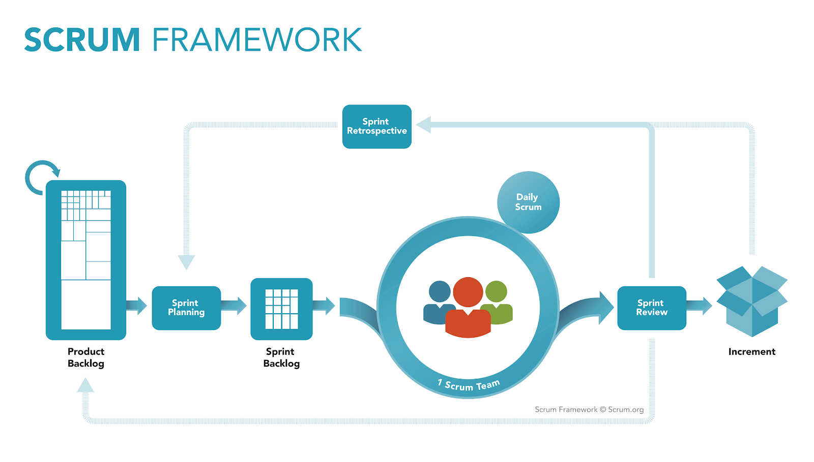
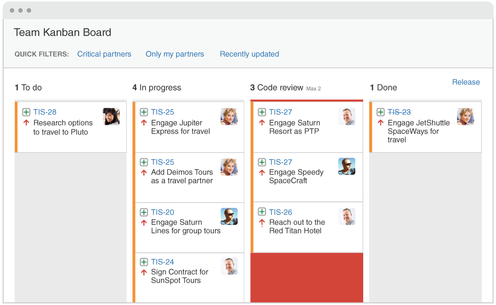
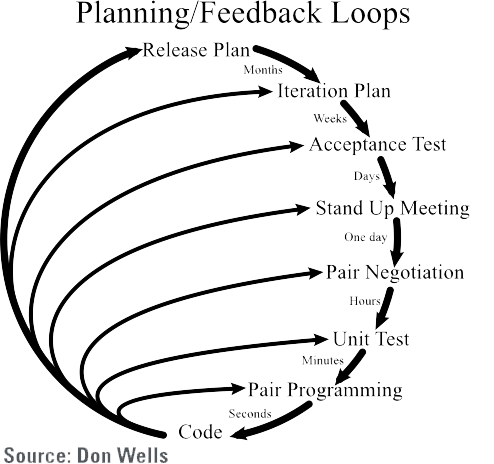
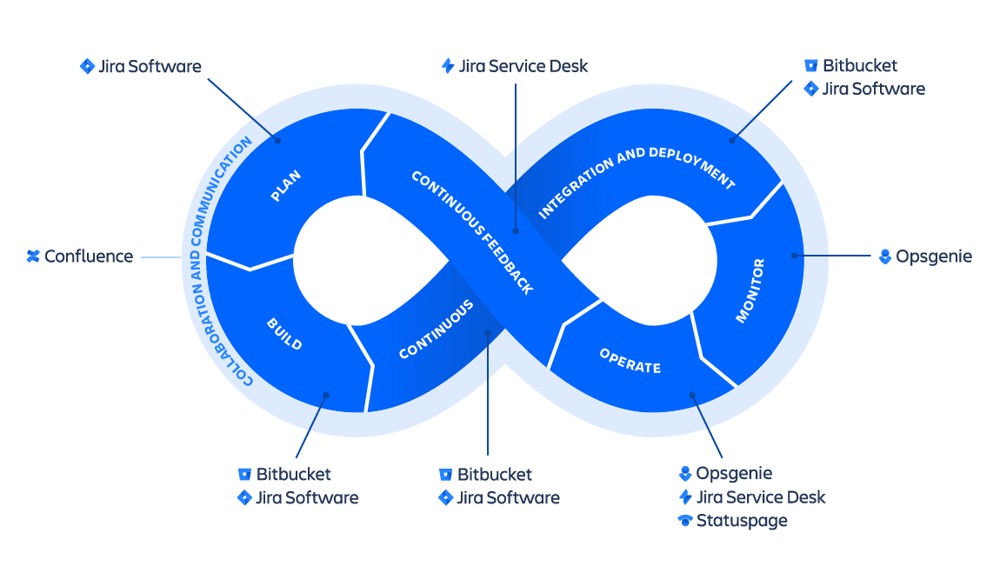

# Agile Product Management

## What is Agile and Why It Works

- Quite the contrary of traditional management styles, agile product management offers to build softwares in a iterative way. What it means that there are no phases that blocks another work. Instead, there are sprints that focuses a small but explicit work which makes it interactive with the end user to get more feedback, keep up the trends and open to changes.

## How to Start Agile

### Defining a Time Frame

- Instead of obsessing over dates, agile development focuses on delivering a usable product to customers every sprint.

### Defining What You Want to Achieve

- What is the done for each sprint should be clear, and explicit without leading to confusion so that we know when to mark the task done.

### Collabrate on the narrative

- Whole team should work together on each every steps of the project from user stories to designing sprints and running them so that different ideas come together which brings new ideas and insights.

### Prototype

- Prototyping brings the oppurtunity of understanding the intent of the designer instead of group of screenshots.

### Constrains (define user tests)

- Usability testing is an empirical, exploratory and long-established technique to answer questions of how an end user would respond to the software under realistic conditions without spesific instructions.
  - For instance, a goal for usability testing of a furniture retailer’s Web site might be “You’ve just moved and need to do something about your two boxes of books; use the site to find a solution.”
- The team -of usabilty specialists, observe users interactions without infering and take notes using tech like eye tracking or by hand so that we can see the differences our expectations and actual behavior of user.

### Split Into Batches(SPRINTS)

- Sprints are intervals that our scrum team works to complete a bunch of task and are at heart of the scrum and agile methodologies. Getting them right brings ships with fewer headache.

### Design Each Sprint

- Before leaping into action, we need to set up sprints.
- We need to define how long they will be, what they aim and when they start. If sprint planning sessions which kicks off the sprints done well, the process of completing splits will be challenging, motivating and bring success.

### Apply the Lean Approach

- While Agile development makes the progress flexible done by delivering smaal frequent iterations, Lean development is to make development process sustainable done by continuously improving. However, listening to and corporating with customer is the core of the both.

- Lean works in the cycle of "Build-Measure-Learn" defined as validated learning. Lean involves tests, measures and validation of hypothesis of the market. Lean focuses on efforts to provide greatest value for customers.

### Scrum

Encourages teams to learn thru experiences, self organize while working a problem and reflect the win and loses to continuously improve. \

### Kanban Board

- It's a framework to implement agile development. requires full trasparency of work and realtime communication.
- work states are visually represented on Kanban board allowing team members to see every piece of work and its current state.
  

### Extreme Programming

- It emphasizes teamwork and says that the best way to build software is to have a team of people consists managers, customers and developers working together on the same project.
  

### DevOps

- works to automate and integrate the process of software development and IT teams so that they can build, test and release software in faster and more sustainable way.

