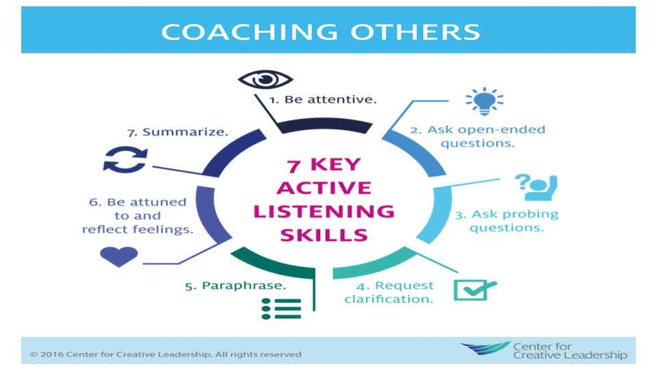
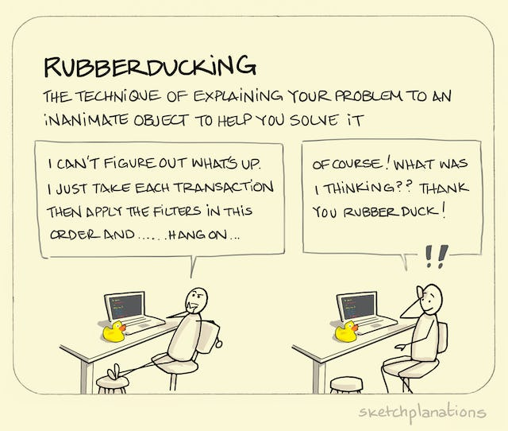

# Business Communications

## Formatting Email

### Caveats

- I should not use emoticons in my business email
- I should use email adresses that just contain my name and surname
- I should not rush to write emails !

### Structure

- Greetings or salutaion is how I should greet my reader.
  - The rule is simple: Dear [title] [last name] or [title] [first name]
  - Hello/hi [title] [last name] may be used.
  - if I don't know who I'm adressing, I can use __"To Whom It May Concern"__

- Then body part:
  - Paragraphs and sentence lengths should tend to be short.
  - I should be direct to the reader, BE CONCISE !
  - Uppercases should be used carefully and as less as possible.

- Signature part that contains some sentences like best regards, sincerely and so on.

## Business Calls

### Do's and Don'ts

- DO prepare for my call as I do for my emails !
- DO find a quite place
- DO INTRODUCE YOUSELF !
- Do state your reason for the call.
- DON'T CAUGHT UP for the minor details unless asked for
7 Keys for Active Listening

## Public Speaking

### Develop Stage Presence

- everyone will be nervous, you will be nervous. So, the auidience expect you to be nervous, no worries.

- Make eye contact

- Project your voice

- Be thrilling, interesting and entartaining.

### Plan the Multimedia

- Keep the powerpoint slide simple, don't fill the page with sentences which won't even be read !

- Don't read slides, prepare your slide flow !

- Sequence of images can be ok if no slides

### Tell A Story

- A good story comes with good connection between cases. Create emotional connections between ideas.

- So that you can engage the audience, can create the curiosity __that your audience allows to get your idea__ !

### Practise Your Speech

- In front of small audience !

- Toastmasters ! (provides an opportunity and a supportive environment to improve your public speaking, communication, and leadership skills)

- Rubberducking

- Use the mouth-to-pencil technique for voice power

### DON'T APOLOGIZE

- Even tough you don't want to be rude, apologizing during a speech just make you lose your attention. Whatsmore, the audience don't even realize until you point your mistake out !

- OFC, if you said something quite wrong, do quick apologize and move on

### Put Yourself In Audience

- What might they not understand ?

- What might seem boring ?

- What kind of audience you might have and stories you have to tell them ?

### HAVE FUN

- Feel pround and enjoy the moment. It is an honor to speak to an audience !

[A good talk](https://www.ted.com/talks/chris_anderson_ted_s_secret_to_great_public_speaking) by Chris Anderson, Head of TED
