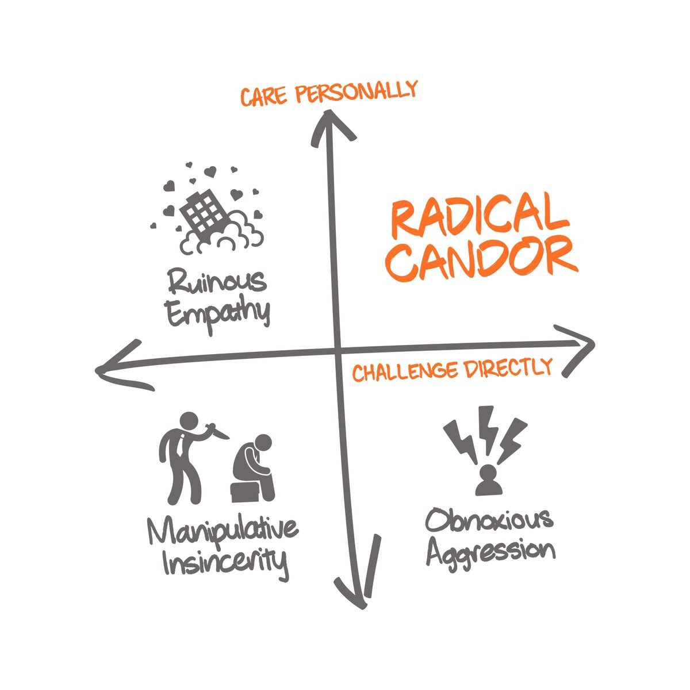
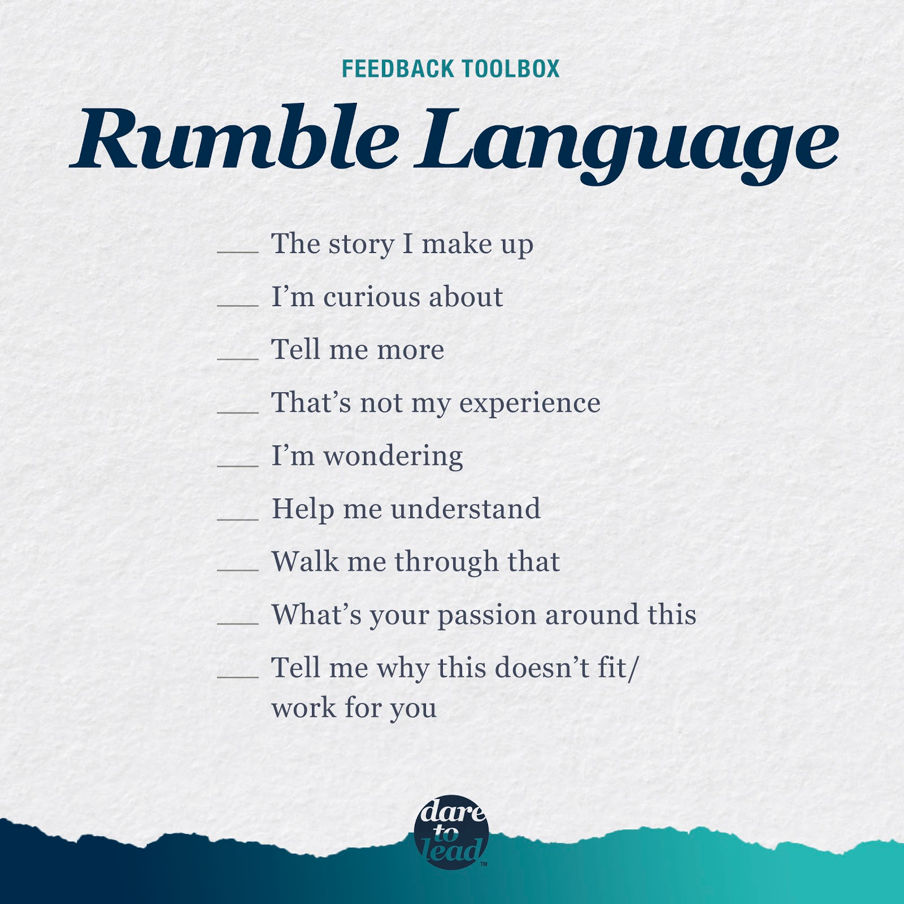

# Teamwork

## Why Teamwork ?

- There are many reasons but most importantly a team works well:
  - creates new innovative ideas
  - courages healty taking-risks
  - helps solving difficult problems
  - builds trust and community.

## The Google Study

### What Matters on Teamwork ?

- According to the Google Study
  - Psychological Safety which means team mates feel to free to take risks and be vulnerable in front of each other.
  - Dependability which means team mates get work done on time.
  - Structure and Clarity which means team mates have clear roles, plans and goals.
    - Use [OKRs](https://rework.withgoogle.com/guides/set-goals-with-okrs/steps/introduction/) of Google. They aims stretching borders and provide obvious goals.
  - Meaning and Impact of their task

- To measure a team’s level of psychological safety, Edmondson asked team members how strongly they agreed or disagreed with these statements:
  - If you make a mistake on this team, it is often held against you.
  - Members of this team are able to bring up problems and tough issues.
  - People on this team sometimes reject others for being different.
  - It is safe to take a risk on this team.
  - It is difficult to ask other members of this team for help.
  - No one on this team would deliberately act in a way that undermines my efforts.
  - Working with members of this team, my unique skills and talents are valued and utilized.

- Radical Candor daresay that when people care each other and express their feelings, feedbacks, critisizims, the place become Radical Candor which makes a good team, good work environment. See the [video](https://www.youtube.com/watch?v=yj9GLeNCgm4)

- Radical Candor is defined with the acronym HHIPP. “Radical candor is Humble, it’s Helpful, it’s Immediate, it’s in Person — in private if it’s criticism and in public if it’s praise — and it doesn’t Personalize."

- here are some feedback starter languages:

